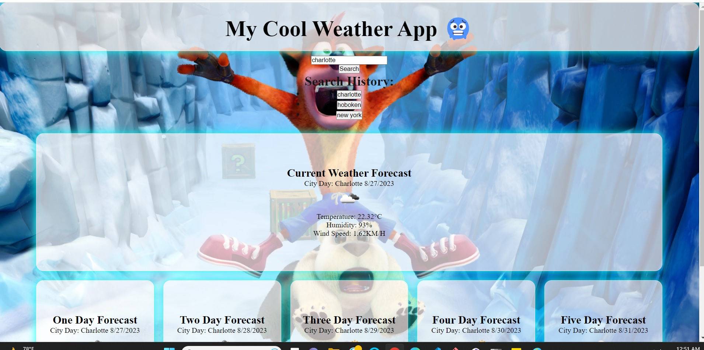
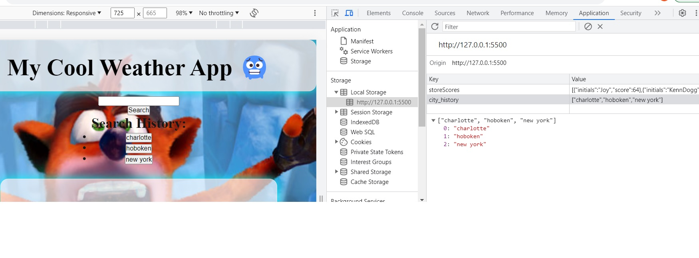

# 06 Server-Side APIs: Weather Dashboard

## Tasks

Third-party APIs allow developers to access their data and functionality by making requests with specific parameters to a URL. Developers are often tasked with retrieving data from another application's API and using it in the context of their own. My challenge is to build a weather dashboard that will run in the browser and feature dynamically updated HTML and CSS. The challenges for me where actually figuring out bootstrap, jquery and creating the javascript to actually utilize the api. In the future I would like to tackle this project again and utilize bootstrap and jquery. I am thankful for my fellow students, youtube and W3.

api key 961c97474e283a72c3bce315872b931b

link href="https://cdn.jsdelivr.net/npm/bootstrap@5.1.3/dist/css/bootstrap.min.css" rel="stylesheet" integrity="sha384-1BmE4kWBq78iYhFldvKuhfTAU6auU8tT94WrHftjDbrCEXSU1oBoqyl2QvZ6jIW3" crossorigin="anonymous">

script src="https://code.jquery.com/jquery-3.4.1.min.js">

## Acceptance Criteria

- GIVEN a weather dashboard with form inputs
- WHEN I search for a city
- THEN I am presented with current and future conditions for that city and that city is added to the search history
- WHEN I view current weather conditions for that city
- THEN I am presented with the city name, the date, an icon representation of weather conditions, the temperature, the humidity, and the wind speed
- WHEN I view future weather conditions for that city
- THEN I am presented with a 5-day forecast that displays the date, an icon representation of weather conditions, the temperature, the wind speed, and the humidity
- WHEN I click on a city in the search history
- THEN I am again presented with current and future conditions for that city

## Grading Requirements

### Technical Acceptance Criteria: 40%

- Satisfies all of the above acceptance criteria plus the following:

  - Uses the OpenWeather API to retrieve weather data.

  - Uses `localStorage` to store persistent data.

### Deployment: 32%

- Application deployed at live URL.

- Application loads with no errors.

- Application GitHub URL submitted.

- GitHub repository that contains application code.

### Application Quality: 15%

- Application user experience is intuitive and easy to navigate.

- Application user interface style is clean and polished.

- Application resembles the mock-up functionality provided in the Challenge instructions.

### Repository Quality: 13%

- Repository has a unique name.

- Repository follows best practices for file structure and naming conventions.

- Repository follows best practices for class/id naming conventions, indentation, quality comments, etc.

- Repository contains multiple descriptive commit messages.

- Repository contains quality readme file with description, screenshot, and link to deployed application.

## Link

## Pics

